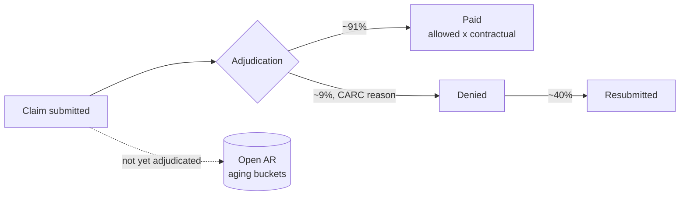

# Healthcare Claims Analytics — Revenue Cycle Dashboard


A hospital revenue-cycle analytics platform: synthetic claims lifecycle data
(submission → adjudication → paid / denied / pending AR), a metrics engine
that reproduces every dashboard number outside Power BI, and a three-page
Power BI dashboard covering the KPIs a revenue-cycle director actually
manages — denial rate, clean claim rate, net collection rate, days to
adjudicate, and AR aging.

**Synthetic data only — no PHI.** No real patients, providers, or payer
contracts; payer behavior (contractual rates, denial rates, adjudication
lag) is modeled on publicly documented industry norms.

## Dashboard

Three-page Power BI report, hand-authored as a Power BI Project (TMDL
semantic model + PBIR report definition) in [`powerbi/pbip/`](powerbi/pbip/)
— open `RevenueCycleAnalytics.pbip` in Power BI Desktop and hit Refresh.

**Revenue Cycle Scorecard** — the numbers a CFO asks for first: denial rate
vs target (gauge), cash collected trend, denial rate by payer:


**Denial Analytics** — root-cause triage: denial dollars by CARC reason,
concentration by service line, trend by payer type:


**AR Aging** — the collections work list: aging buckets by payer type, claim
pipeline, and the row-level open-AR list a follow-up team works from:


## Why this project

Revenue cycle is where healthcare finance lives or dies: a hospital that
denies 9% of claims and lets a third of its AR age past 90 days is leaving
millions uncollected. The metrics here are the standard HFMA-style KPI set:

| KPI | Definition in this model |
|---|---|
| Denial rate | Denied ÷ adjudicated claims (Paid + Denied) |
| Clean claim rate | Paid first-pass (never resubmitted) ÷ adjudicated |
| Net collection rate | Paid $ ÷ allowed $ (post-contractual) |
| Avg days to adjudicate | Submission → adjudication lag |
| AR > 90 | Open (pending) claim dollars older than 90 days |

The synthetic generator deliberately gives each payer its own personality —
Medicaid denies more and pays slower; Medicare pays fast at a lower
contractual rate — so every chart has believable signal, not noise.

## The claim lifecycle modeled



## Repo layout

```
data_generator/     synthetic claims generator (12k claims, 8 payers, fixed seed)
data/               generated CSVs: dim_payer, dim_provider, dim_service_line, fact_claims
engine/             metrics engine: denial summary, AR aging snapshot, KPI summary
output/             engine results — every dashboard number, reproducible outside Power BI
powerbi/            ready-to-open PBIP (TMDL model + PBIR report, 17 DAX measures)
tests/              pytest suite: financial ordering, status consistency, AR control totals
.github/workflows/  CI — regenerates data, rebuilds metrics, runs the tests on every push
```

## How to reproduce (60 seconds, no database needed)

```bash
python data_generator/generate_claims_data.py   # 12,000 synthetic claims
python engine/build_rcm_metrics.py              # denial summary + AR aging + KPI summary
pytest tests/ -v                                # 5 invariants, incl. AR control totals
```

Then open `powerbi/pbip/RevenueCycleAnalytics.pbip` (see
[`powerbi/pbip/OPEN_ME_FIRST.md`](powerbi/pbip/OPEN_ME_FIRST.md)) and Refresh.

## Data-quality invariants CI enforces

- **Financial ordering** — paid ≤ allowed ≤ submitted on every paid claim
  (payment-posting audit arithmetic).
- **Status consistency** — every denial carries a CARC reason and zero
  payment; every pending claim carries an AR bucket and no adjudication date.
- **AR control totals** — the AR aging output ties to pending claims to the
  penny, the same control-total discipline as a GL reconciliation.
- **Plausibility band** — overall denial rate must stay within the
  industry-plausible 5–15% range.

## Notes on the synthetic data

Generated with a fixed seed for reproducibility. Payer mix, denial reason
distribution (CO-16 missing info leading, as it does in practice), and
adjudication lags are calibrated to publicly available industry benchmarks,
not to any real organization's data.
