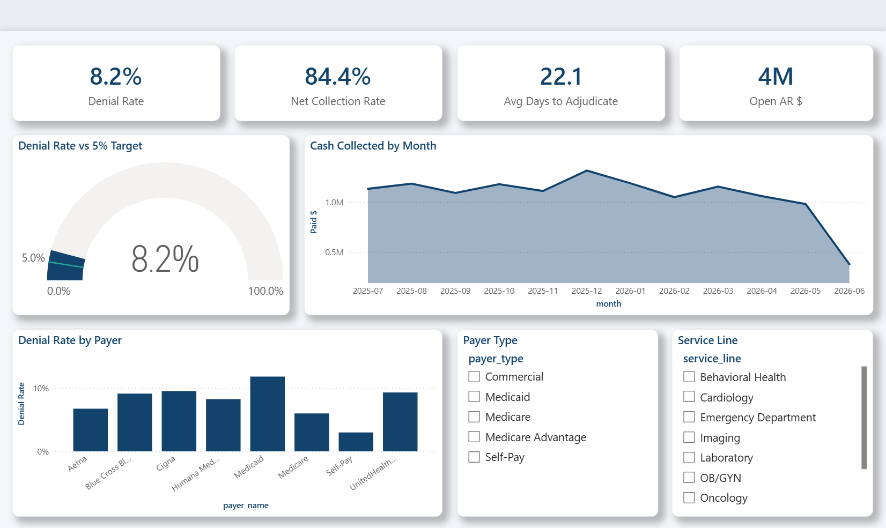
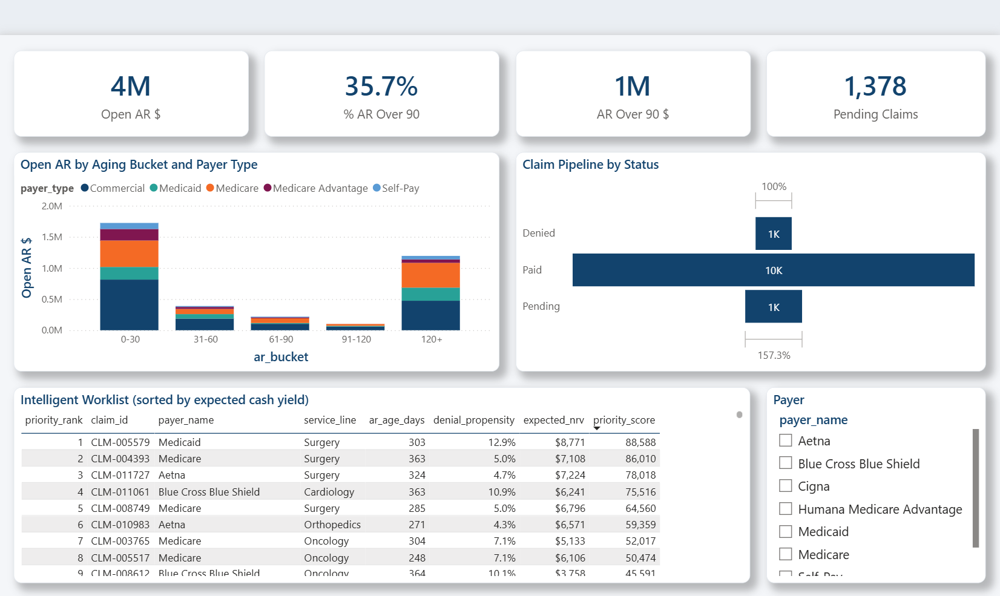
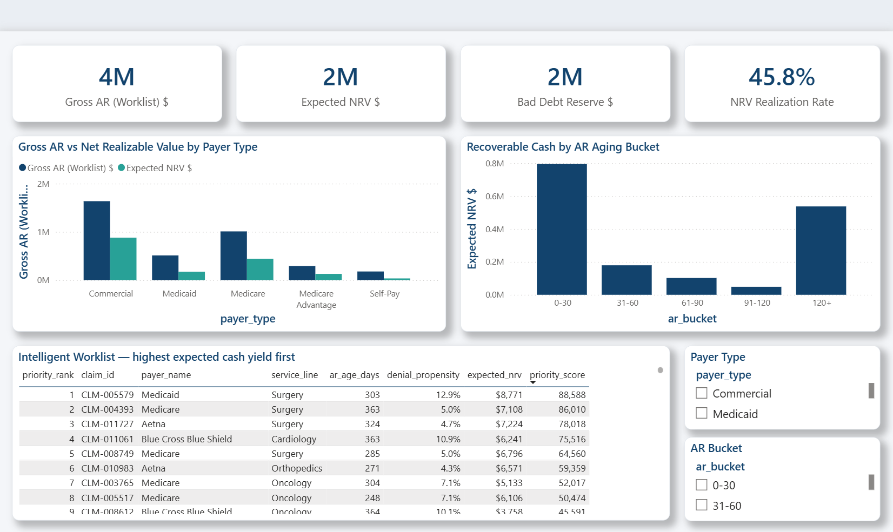
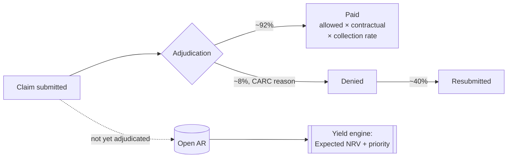

# Healthcare Claims Analytics — Revenue Cycle Dashboard


A hospital revenue-cycle analytics platform: synthetic claims lifecycle data
(submission → adjudication → paid / denied / pending AR), a metrics engine
that reproduces every dashboard number outside Power BI, and a four-page
Power BI dashboard that goes from **descriptive** (denial rate, AR aging) to
**predictive** — a Net Realizable Value (NRV) model that forecasts how much of
the open AR the hospital will actually collect, and an expected-yield worklist
that tells the follow-up team which accounts to work first.

**Synthetic data only — no PHI.** No real patients, providers, or payer
contracts; payer behavior (contractual rates, denial rates, adjudication lag,
collection rates) is modeled on publicly documented industry norms.

## The engineering principle

All business logic lives in a verifiable Python engine and is proven by
`pytest` in CI **before** Power BI opens the file. Power BI is a presentation
layer only — no probability modeling or yield math in DAX. Every number on the
dashboard can be reproduced from the command line and is guarded by an
invariant test. The predictive layer holds to the same rule: the NRV and
priority math is Python, tested to the penny; the dashboard just draws it.

## Dashboard

Four-page Power BI report, hand-authored as a Power BI Project (TMDL semantic
model + PBIR report definition) in [`powerbi/pbip/`](powerbi/pbip/) — open
`RevenueCycleAnalytics.pbip` in Power BI Desktop and hit Refresh.

**Revenue Cycle Scorecard** — the numbers a CFO asks for first: denial rate
vs target (gauge), cash collected trend, denial rate by payer:



**Denial Analytics** — root-cause triage: denial dollars by CARC reason,
concentration by service line, trend by payer type:


**AR Aging** — the collections view: aging buckets by payer type, claim
pipeline, and the priority-sorted **Intelligent Worklist** a follow-up team
works from:



**Predictive Yield (NRV)** — the CFO reserve view: gross AR vs. Net Realizable
Value by payer type, where the collectable cash actually sits by aging bucket,
and the expected-yield worklist sorted by priority score:



## Why NRV changes the conversation

Anyone can sum "days in AR." The senior insight is that **not every AR dollar is
worth a dollar.** $100k of Medicare AR is close to cash — Medicare pays ~91% of
the allowed amount, reliably. $100k of Self-Pay AR is worth a fraction of that,
because self-pay collects ~20 cents on the dollar and the rest ages into bad
debt. A worklist sorted alphabetically by payer ignores this; a worklist sorted
by **expected cash yield** works the dollars most likely to actually land.

In this dataset the model nets **$3.63M of gross open AR down to $1.66M of
Expected NRV** — a 46% realization rate, i.e. a **~54% bad-debt reserve**. That
delta is exactly the number a hospital CFO books as a reserve, and here it is
computed from first principles, not guessed.

| Payer type | Net collection rate (of allowed) | Expected yield (per billed $) |
|---|---:|---:|
| Commercial | 90% | 53% |
| Medicare Advantage | 90% | 45% |
| Medicare | 91% | 44% |
| Medicaid | 89% | 35% |
| **Self-Pay** | **21%** | **20%** |

## How the NRV / yield model works

A pending claim has only a *billed* (submitted) amount — it hasn't been
adjudicated, so it has no allowed or paid amount yet. To forecast the cash it
will realize, the engine decomposes the billed dollar through the three things
that historically happen to it, learned **per payer × service line** from
adjudicated claims only:

```
expected_yield_rate = contractual_factor      # allowed / billed   (paid claims)
                    × net_collection_rate      # paid / allowed     (paid claims)
                    × (1 − denial_propensity)  # P(adjudicates as paid)

Expected_NRV   = billed_amount × expected_yield_rate
Priority_Score = Expected_NRV × (days_in_AR / 30)
```

**Empirical-Bayes shrinkage.** Payer × service-line cells are thin — a payer
that shows up in a handful of Oncology claims would otherwise get a wild rate
(0% or 100% denial off two claims). The engine shrinks every cell toward its
own payer's rate, and each payer toward the portfolio rate (a two-level
hierarchical prior). A thin Self-Pay/Oncology cell borrows strength from *all*
Self-Pay claims — which really do collect ~20¢ — not from the global average
that Medicare and commercial payers dominate. Shrinkage also guarantees every
probability lands strictly inside (0, 1), which the invariant tests then prove.

## Deliberate deviations from the brief

This upgrade was scoped from a written brief. Two points were changed on
purpose, because implementing them verbatim would have produced numbers that
can't be defended — and this repo's whole point is that it ships nothing it
can't prove:

- **NRV is decomposed from the billed amount, not the allowed amount.** The
  brief specified `Expected_NRV = allowed × yield`, but a *pending* claim has no
  allowed amount yet — it isn't adjudicated. Multiplying a blank field would
  produce zero NRV for the entire open AR. The engine instead estimates the
  expected allowed amount (`billed × contractual_factor`) and carries it through
  collection and denial, so the NRV ceiling test becomes `NRV ≤ billed` — a
  bound that actually exists in the data.
- **The priority score does not multiply by `(1 − denial)` a second time.** The
  brief's `Expected_NRV × (1 − denial) × age` double-counts denial, because
  Expected_NRV already nets out denial probability. The engine uses
  `Expected_NRV × (days_in_AR / 30)` so a claim is not penalized for denial risk
  twice.

## KPI definitions

| KPI | Definition in this model |
|---|---|
| Denial rate | Denied ÷ adjudicated claims (Paid + Denied) |
| Clean claim rate | Paid first-pass (never resubmitted) ÷ adjudicated |
| Net collection rate | Paid $ ÷ allowed $ (post-contractual) |
| Avg days to adjudicate | Submission → adjudication lag |
| AR > 90 | Open (pending) claim dollars older than 90 days |
| **Expected NRV** | Forecast cash on open AR: Σ billed × expected yield rate |
| **Bad-debt reserve** | Gross open AR − Expected NRV |
| **Priority score** | Expected NRV × (days in AR ÷ 30) — the worklist rank |

## The claim lifecycle modeled



## Repo layout

```
data_generator/     synthetic claims generator (12k claims, 8 payers, fixed seed)
data/               generated CSVs: dim_payer, dim_provider, dim_service_line, fact_claims
engine/             metrics engine: denial summary, AR aging, KPI summary, NRV/yield worklist
output/             engine results — every dashboard number, reproducible outside Power BI
                    incl. ar_yield_predictions.csv (worklist) + payer_yield_rates.csv
powerbi/            ready-to-open PBIP (TMDL model + PBIR report, 22 DAX measures, 4 pages)
tests/              pytest suite: financial ordering, status/AR control totals,
                    NRV invariants, and Power BI report/model integrity
.github/workflows/  CI — regenerates data, rebuilds metrics, runs the tests on every push
```

## How to reproduce (60 seconds, no database needed)

```bash
python data_generator/generate_claims_data.py   # 12,000 synthetic claims
python engine/build_rcm_metrics.py              # denial + AR aging + KPI + NRV worklist
pytest tests/ -v                                # 19 invariants
```

Then open `powerbi/pbip/RevenueCycleAnalytics.pbip` (see
[`powerbi/pbip/OPEN_ME_FIRST.md`](powerbi/pbip/OPEN_ME_FIRST.md)) and Refresh.

## Data-quality invariants CI enforces

Descriptive layer:

- **Financial ordering** — paid ≤ allowed ≤ submitted on every paid claim.
- **Status consistency** — every denial carries a CARC reason and zero payment;
  every pending claim carries an AR bucket and no adjudication date.
- **AR control totals** — the AR aging output ties to pending claims to the
  penny, the same control-total discipline as a GL reconciliation.
- **Plausibility band** — overall denial rate stays within 5–15%.

Predictive layer (NRV / yield):

- **NRV ceiling** — Expected NRV never exceeds the billed amount, nor the
  expected allowed amount. You cannot forecast collecting more than a claim is
  worth.
- **Probability bounds** — every denial propensity is strictly inside (0, 1),
  and each yield factor stays in its natural range.
- **Decomposition identity** — yield = contract × NCR × (1 − denial), and
  NRV = billed × yield, proven row by row.
- **Priority ranking** — the worklist is sorted by priority score with a dense
  1..N rank, and every open claim is scored exactly once.
- **Yield control total** — total Expected NRV ties to gross open AR and is
  strictly below it, and the overall realization rate stays in a believable band.
- **Self-pay economics** — a Self-Pay dollar of AR must be worth materially less
  than an insured dollar; if the engine stops seeing that, the NRV story is
  broken regardless of whether the arithmetic still balances.

Power BI integrity (proven without opening Power BI):

- **Field references resolve** — every column/measure/sort field a visual
  references exists in the TMDL model (a mistyped field renders a blank visual,
  not an error).
- **Model consistency** — relationships and sort-by columns point at real
  columns; the yield table's columns match the engine's CSV headers exactly.

## Notes on the synthetic data

Generated with a fixed seed for reproducibility. Payer mix, denial reason
distribution (CO-16 missing info leading, as it does in practice), adjudication
lags, and collection rates are calibrated to publicly available industry
benchmarks, not to any real organization's data. Self-Pay is deliberately
modeled with full-charge billing and low collection so the yield engine can
demonstrate the payer-economics point that NRV exists to capture.
