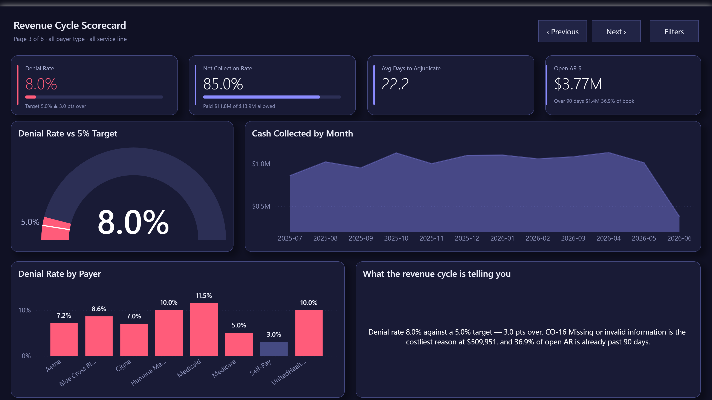
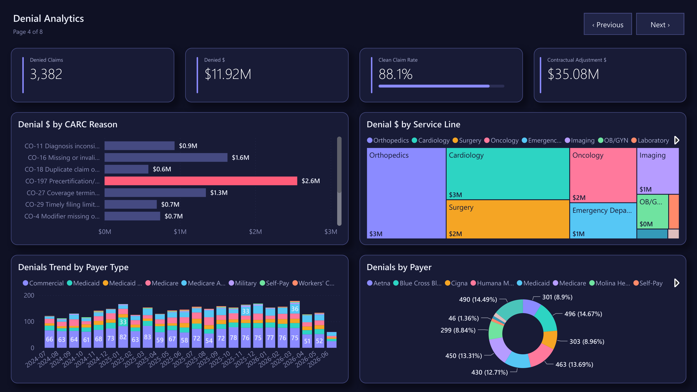
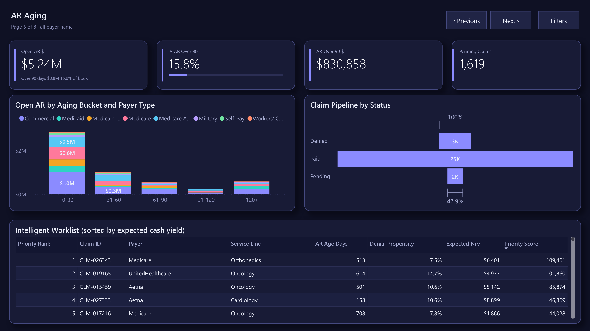
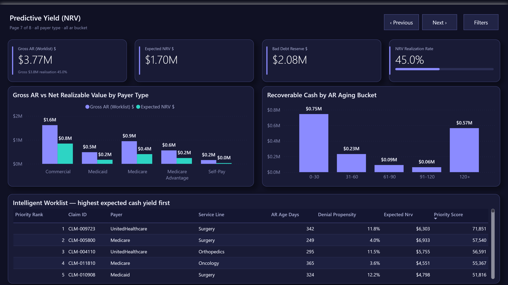
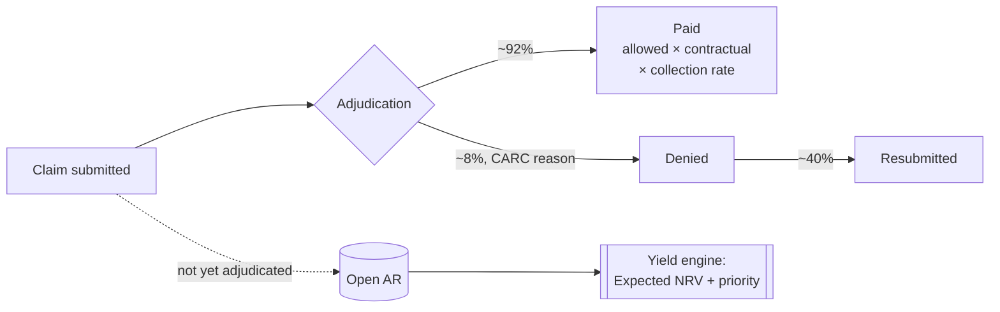

# Health System Decision Support — activity, economics, and revenue cycle


Two health systems, one engineering standard.

**Act one — a Canadian health authority.** CIHI-DAD-shaped inpatient activity for
a six-site authority: cost per weighted case, length-of-stay index, alternate
level of care, and risk-adjusted readmission; statistical process control that
separates a real shift from ordinary variation; and a full economic evaluation
of a proposed intervention — ICER, tornado, and probabilistic sensitivity — that
ends in a briefing note and a costed business case.

**Act two — a US hospital revenue cycle.** The claim lifecycle from submission to
paid, denied, or pending AR, plus a Net Realizable Value model that prices $3.6M
of open AR at the ~$1.7M it will actually collect, and an expected-yield worklist
telling the follow-up team which accounts to work first.

**All data is synthetic — no PHI.** No real patients, facilities, providers, or
payer contracts. Behaviour is modelled on publicly documented patterns.

## The engineering principle

Every number lives in a verifiable Python engine and is proven by `pytest` in CI
**before** Power BI opens the file. Power BI is a presentation layer only — no
probability modelling, yield maths, or control limits in DAX. Every figure on a
dashboard, in the briefing note, or in the business case reproduces from the
command line and is guarded by an invariant test.

Pure standard library throughout. No install step, no database; the whole thing
rebuilds in about five seconds.

---

# Act one — Canadian health authority decision support

In a single-payer system there are no payers, no denials, and no bad-debt
reserve. A BC health authority does not ask what its denial rate is. It asks
what a weighted case costs, whether patients stay longer than their case mix
predicts, how many beds are occupied by people who no longer need acute care,
and whether this month's readmission rate is a signal or noise.

**Dataset:** 39,567 discharge abstracts over 24 months, six facilities, 17 CMG+
case mix groups, with RIW, expected LOS, ALC days, comorbidity level, and
disposition. Volume is calibrated so the authority is internally coherent —
~20,000 discharges a year against 490 staffed beds is roughly 85% occupancy at
the modelled length of stay. A bed-day business case built on a dataset whose
occupancy is physically impossible does not survive its first reading.

## The four indicators

```
Discharges:                               39,567
Weighted cases (sum RIW):               58,727.7
Cost per weighted case:                    8,449
  ...excluding ALC:                        7,635
  ...ALC component:                          814
ALC rate (% of patient days):              13.8%
ALC bed equivalents (24 mo):            56.9 beds
30-day readmission rate:                    9.9%
```

**Splitting ALC out of cost per weighted case is not cosmetic.** ALC cost is not
a measure of how efficiently a site treats its cases — it is the price of a
discharge destination that does not exist. Leaving it inside CPWC makes the site
with the weakest *community* capacity look like the site with the worst cost
control. Harbourview is second-highest on the headline figure and mid-pack once
ALC is removed.

**Risk adjustment uses indirect standardisation** with empirical-Bayes shrinkage
on thin strata — the same technique the NRV engine uses on thin payer × service
line cells. The defining identity (Σ expected = Σ observed, so the
authority-wide O/E is exactly 1.00) is asserted by test; if it drifts, the ratios
are measuring the standardisation rather than the sites. A test also demands the
adjustment move the ranking *in the direction case mix predicts* — the site with
the heaviest case mix has to rank better once adjusted, the site with the
lightest has to rank worse, and at least one site has to move two places rather
than swapping on a rounding error. Merely asserting that the two rankings
differ, which is what this test used to do, is close to free: with six sites any
tie-break flip satisfies it, and a *broken* adjustment satisfies it more reliably
than a correct one, because noise reorders more readily than signal. Inverting
the O/E ratio — an easy bug to write — passes the old assertion and fails the
new one.

## Statistical process control, and the trap in it

The default way an indicator gets reported — "readmissions were 11.4%, up from
10.8%" — is a category error. Every process varies. Reacting to ordinary
variation makes the process worse; sitting on a genuine shift because it looked
small is how a problem runs for two quarters.

[`engine/spc.py`](engine/spc.py) implements p-charts, u-charts, the four Western
Electric rules, Laney's overdispersion correction, and phase I/phase II
baselines. Three findings came out of pointing it at ALC:

**1. The metric everyone asks for is the one that lies.** ALC *days* per 100
patient days is heavily overdispersed — measured dispersion **4.6×** Poisson over
the baseline, because one patient waiting sixty days contributes sixty correlated
days, not sixty independent events. Run naively it fires **41 point-signals
across 19 of 24 months**. A chart that cries wolf in four months out of five is
ignored within a quarter, which is worse than no chart.

**2. Correcting is good; changing the unit of analysis is better.** Laney's u′
brings it to **10 signals in 4 months**. But the share of *stays* with any ALC day
is one independent observation per patient, has dispersion **1.18** against 4.6
for the day-level chart, and detects the planted shift **in its first month**.
Removing clustering at the source beats correcting for it afterwards.

Signals are counted per point, as Minitab and qicharts2 count them: a month
beyond 3σ is also beyond 2σ and 1σ, so one month can trip three rules. The count
of distinct months is reported beside the raw count throughout, because that is
the number an analyst actually works.

**3. The baseline is where charts quietly go wrong.** Compute the centre line
over the whole series, including the period you are assessing, and a genuine
late shift drags the centre up — flagging every *stable* month before it as a
downward special cause. You get a chart reporting a problem in the period where
nothing happened. There is a test that plants a shift, runs the chart both ways,
and asserts the contaminated version misfires exactly this way.

Readmission was deliberately left stable, and the chart correctly says nothing —
the negative control that stops the whole exercise being confirmation bias.

## Health economics: the same evidence, opposite recommendations

[`engine/health_economics.py`](engine/health_economics.py) evaluates a $1.45M
transitional-care program against the ALC problem, and the interesting result is
that it does not have one answer.

Almost every hospital business case values an avoided bed day at the fully
absorbed per-diem and books it as a saving. That is usually wrong. Unless the bed
closes and the staffing goes, the fixed cost stays. What you created is
*capacity*, not cash. So the model reports both perspectives explicitly:

| | Perspective A — opportunity cost | Perspective B — cash-releasing |
|---|---|---|
| Bed day valued at | full $1,150 per-diem | variable share only (32%) |
| Incremental cost | **−$2,916,613** | **+$658,980** |
| Result | **Dominant** | **ICER $192,163/QALY** |
| P(cost-effective @ $50k/QALY) | **99.7%** | **16.9%** |

Both are correct; they answer different questions. Perspective A asks what the
program is worth to the health system, B asks what it does to next year's
operating budget. A business case presenting only A is why finance departments
distrust business cases.

The tornado shows **two parameters flip the recommendation on their own** — the
cash-releasing share and the effectiveness rate — and neither is the program
price. Negotiating the cost down does not rescue a weak case, so that is not
where the effort should go.

10,000-iteration PSA (Beta for proportions, Gamma for costs) produces the
acceptability curves. They never converge, because the uncertainty that matters
here is *structural* — which perspective applies — and no amount of extra Monte
Carlo sampling resolves a structural question.

**Deliverables, in the form a health authority actually consumes:**

- **[`docs/BRIEFING_NOTE.md`](docs/BRIEFING_NOTE.md)** — Issue / Background /
  Analysis / Options / Risks / Recommendation, for a VP.
- **[`docs/BUSINESS_CASE.md`](docs/BUSINESS_CASE.md)** — full costing, both
  perspectives, sensitivity, risk register, measurement plan, exit criteria.

The recommendation is to approve — **conditional on a documented backfill
commitment**, and explicitly *not* as a savings initiative. On the evidence this
program is very probably the right thing to do and very probably not a saving.
Saying both is what makes the first half believable.

---

# Act two — US hospital revenue cycle

Four-page Power BI report, hand-authored as a Power BI Project (TMDL semantic
model + PBIR report definition) in [`powerbi/pbip/`](powerbi/pbip/) — open
`RevenueCycleAnalytics.pbip` in Power BI Desktop and hit Refresh.

**Revenue Cycle Scorecard** — denial rate vs target, cash collected trend, denial
rate by payer:



**Denial Analytics** — root-cause triage: denial dollars by CARC reason,
concentration by service line, trend by payer type:



**AR Aging** — aging buckets by payer type, claim pipeline, and the
priority-sorted Intelligent Worklist:



**Predictive Yield (NRV)** — gross AR vs Net Realizable Value by payer type, and
the expected-yield worklist:



## Why NRV changes the conversation

Anyone can sum days in AR. The senior insight is that **not every AR dollar is
worth a dollar.** $100k of Medicare AR is close to cash — Medicare pays ~91% of
allowed, reliably. $100k of Self-Pay AR is worth a fraction, because self-pay
collects ~20 cents on the dollar and the rest ages into bad debt.

The model nets **$3.63M of gross open AR down to $1.66M of Expected NRV** — a 46%
realization rate, i.e. a ~54% bad-debt reserve. That delta is exactly the number
a CFO books as a reserve, computed from first principles rather than guessed.

| Payer type | Net collection rate | Expected yield (per billed $) |
|---|---:|---:|
| Commercial | 90% | 53% |
| Medicare Advantage | 90% | 45% |
| Medicare | 91% | 44% |
| Medicaid | 89% | 35% |
| **Self-Pay** | **21%** | **20%** |

```
expected_yield_rate = contractual_factor      # allowed / billed   (paid claims)
                    × net_collection_rate      # paid / allowed     (paid claims)
                    × (1 − denial_propensity)  # P(adjudicates as paid)

Expected_NRV   = billed_amount × expected_yield_rate
Priority_Score = Expected_NRV × (days_in_AR / 30)
```

**Empirical-Bayes shrinkage.** Payer × service-line cells are thin — a payer with
a handful of Oncology claims would otherwise get a wild rate. Every cell shrinks
toward its own payer's rate, and each payer toward the portfolio rate. A thin
Self-Pay/Oncology cell borrows strength from *all* Self-Pay claims, which really
do collect ~20¢, not from a global average Medicare dominates.

### Deliberate deviations from the brief

- **NRV is decomposed from billed, not allowed.** A *pending* claim has no
  allowed amount — multiplying a blank field would produce zero NRV for the whole
  open AR. The engine estimates expected allowed (`billed × contractual_factor`)
  and carries it through, so the ceiling test becomes `NRV ≤ billed` — a bound
  that exists in the data.
- **Priority does not multiply by `(1 − denial)` twice.** `Expected_NRV` already
  nets out denial probability, so the naive formula double-counts it.

### KPI definitions

| KPI | Definition in this model |
|---|---|
| Denial rate | Denied ÷ adjudicated claims (Paid + Denied) |
| Clean claim rate | Paid first-pass (never resubmitted) ÷ adjudicated |
| Net collection rate | Paid $ ÷ allowed $ (post-contractual) |
| Avg days to adjudicate | Submission → adjudication lag |
| AR > 90 | Open (pending) claim dollars older than 90 days |
| **Expected NRV** | Forecast cash on open AR: Σ billed × expected yield rate |
| **Bad-debt reserve** | Gross open AR − Expected NRV |
| **Priority score** | Expected NRV × (days in AR ÷ 30) — the worklist rank |


```mermaid
flowchart LR
    SUB[Claim submitted] --> ADJ{Adjudication}
    ADJ -->|"~92%"| PAID[Paid<br/>allowed × contractual<br/>× collection rate]
    ADJ -->|"~8%, CARC reason"| DEN[Denied]
    DEN -->|"~40%"| RESUB[Resubmitted]
    SUB -.->|not yet adjudicated| AR[(Open AR)]
    AR --> NRV[[Yield engine:<br/>Expected NRV + priority]]
```

---

# Governance: privacy and data quality

## De-identification with a measured risk

Every dataset here is synthetic, so nothing in
[`governance/deidentify.py`](governance/deidentify.py) protects a real person.
That is exactly why it is worth building — the technique has to exist and be
tested *before* it is pointed at real data, and "we de-identified it" is the most
over-claimed sentence in health analytics.

Two things happen, and they are not the same:

1. **HIPAA Safe Harbor** — the 18 direct-identifier categories, matched by
   *pattern* rather than a hard-coded list, so a newly added identifier column
   fails the test on arrival.
2. **k-anonymity (k=5)** — the hard half. Nobody is re-identified by their name
   in a de-identified file; they are re-identified by the *combination* that
   survives it. Generalise first, suppress only as a fallback.

```
Records in:                           39,567
Unique on quasi-identifiers:             449 (1.14%)
Records generalised:                   3,390
Records suppressed:                    1,405 (3.55%)
Smallest equivalence class:                5
Max re-identification probability:     0.200
```

The suppression *cost* is reported, because a de-identification that hides its
cost cannot be argued with. A test also proves the surviving dataset still
reproduces the authority's ALC share — privacy work that leaves the data unable
to answer its question has only relocated the failure. Another test confirms the
audit trail records keys only, never a suppressed value.

## The data quality gate

[`governance/data_quality.py`](governance/data_quality.py) — 15 declarative rules
across completeness, uniqueness, referential integrity, domain, business logic,
and a freshness SLA. Critical failures exit non-zero and block the refresh;
warnings are recorded and let the run proceed, because halting month-end over
three unexpected disposition codes trades a data problem for an availability
problem.

Rules are data, not code, each carrying a **rationale** — a rule nobody can
explain gets deleted the first time it fires inconveniently. Expression rules use
a tiny named-form language rather than `eval()`, and a test proves an unknown
expression is *refused*: configuration that can execute arbitrary Python is a
supply-chain vulnerability wearing a YAML hat.

```bash
python governance/data_quality.py                   # PUBLISH, exit 0
python governance/data_quality.py --inject-failure  # BLOCKED, exit 2
```

CI runs both, and **fails the build if the corrupted run is allowed through.**
A gate you have never watched close is decoration.

Every run appends JSONL events — `run_id`, rule, status, violations, rows
scanned, duration, verdict — to an ops log Datadog or Azure Monitor can tail
as-is. One `run_id` reconstructs any run end to end, including the failed ones,
which are the runs telemetry exists for.

**[`docs/SOURCE_TO_TARGET.md`](docs/SOURCE_TO_TARGET.md)** carries the full
column-level mapping, transformation rules, ownership, and a consolidated list of
known limitations — in the mapping itself rather than in a separate risk log,
because the place a limitation gets read is next to the column it applies to.

---

## Reproduce everything (about five seconds)

```bash
# Canadian decision support
python canadian/generate_activity_data.py   # 40k DAD-shaped abstracts
python engine/build_activity_metrics.py     # CPWC, LOS index, ALC, SPC charts
python engine/health_economics.py           # base case, tornado, PSA/CEAC

# US revenue cycle
python data_generator/generate_claims_data.py
python engine/build_rcm_metrics.py

# Governance
python governance/deidentify.py
python governance/data_quality.py

pytest tests/ -v                            # 111 invariants
```

Then open `powerbi/pbip/RevenueCycleAnalytics.pbip` (see
[`powerbi/pbip/OPEN_ME_FIRST.md`](powerbi/pbip/OPEN_ME_FIRST.md)) and Refresh.

## What CI enforces

**Activity and funding** — LOS decomposes exactly into acute + ALC days; facility
and monthly rollups tie to the abstracts to the penny; CPWC ex-ALC differs from
the headline by precisely the ALC cost; indirect standardisation satisfies
Σ expected = Σ observed; risk adjustment reorders the sites in the direction case
mix predicts, by at least two places; the planted ALC outlier site is recovered.

**SPC** — each Western Electric rule fires on a series built to trip it and stays
silent otherwise; a missing period breaks a run rather than bridging it, checked
on the *counting* rules 2 and 3 where the guard actually decides the outcome
(rule 4 cannot distinguish, and the test that only checked rule 4 passed with the
guard deleted); a stable process produces zero signals; a planted shift is
detected, in the right direction, promptly; dispersion ≈ 1.0 on binomial data and
> 1.5 on clustered data; Laney widens limits and suppresses false alarms on
overdispersed data, and stays inside a documented band — *not* a no-op — on
well-behaved data; a contaminated baseline misfires in the documented way.

**Published figures** — every headline number in this README and in the two
decision-support documents is re-derived from the engine output and matched
against the prose, character for character. If a generator changes and a document
is not updated, the build fails and names the file. The badge's own test count is
checked the same way. This section is the claim most worth distrusting in any
portfolio repo, so it is the one under the tightest guard.

**Health economics** — incremental cost decomposes exactly; NMB and ICER match
their definitions; QALYs are identical across perspectives while costs are not;
dominance is *labelled*, never left as a bare negative ratio; a zero-effect
program reports no ICER rather than dividing by zero; more effectiveness never
lowers NMB; the CEAC is monotonic and bounded; at least one parameter flips the
decision; Beta fitting survives an impossible standard deviation.

**Governance** — no direct identifier survives (and the source genuinely had
some); every equivalence class meets k; a uniquely identifying combination is
removed; generalisation outweighs suppression; the de-identified data still
answers the question; pseudonyms are salted, stable, and not a bare hash; the
gate closes on a duplicated grain key; every rule carries a severity and a
rationale; an unknown expression rule is refused; every run leaves a
reconstructable trail, including the failures.

**Revenue cycle** — paid ≤ allowed ≤ submitted; every denial carries a CARC
reason and zero payment; AR aging ties to pending claims to the penny; NRV never
exceeds billed or expected allowed; yield = contract × NCR × (1 − denial) row by
row; the worklist is densely ranked and every open claim scored exactly once; a
Self-Pay dollar is worth materially less than an insured one.

**Power BI integrity, without opening Power BI** — every column, measure, and
sort field a visual references exists in the TMDL model (a mistyped field renders
a blank visual, not an error); relationships and sort-by columns point at real
columns; the yield table's columns match the engine's CSV headers exactly.

## Repo layout

```
canadian/           generate_activity_data.py — DAD-shaped abstracts (CMG+, RIW, ALC)
data_generator/     synthetic claims generator (12k claims, 8 payers)
data/               generated CSVs for both datasets
engine/             build_activity_metrics.py — CPWC, LOS index, ALC, risk adjustment
                    spc.py — p/u charts, Western Electric, Laney, baselines
                    health_economics.py — ICER, NMB, tornado, PSA/CEAC
                    build_rcm_metrics.py — denial summary, AR aging, NRV worklist
governance/         deidentify.py — Safe Harbor + k-anonymity + risk report
                    data_quality.py — 15-rule gate, JSONL observability
docs/               BRIEFING_NOTE.md · BUSINESS_CASE.md · SOURCE_TO_TARGET.md
output/             every engine result — reproducible outside Power BI
powerbi/            ready-to-open PBIP (TMDL model + PBIR report, 22 DAX measures)
tests/              111 invariants across activity, SPC, economics, governance,
                    revenue cycle, and Power BI model/report integrity
.github/workflows/  CI — full rebuild, invariants, and the DQ sabotage proof
```

## Notes on the synthetic data

Both datasets use fixed seeds. Payer mix, denial reason distribution (CO-16
leading, as in practice), adjudication lags, collection rates, case mix, RIW,
ALC concentration, and readmission drivers are calibrated to publicly documented
patterns — not to any real organisation's data. Facility names are invented.

Two things are planted on purpose and labelled as such: a **step increase in ALC
risk from January 2026**, so the control charts have a real shift to find, and
**site-level differences** in cost, length of stay, ALC, and acuity, so the site
comparison and the risk adjustment have something genuine to recover. A detector
that cannot find a planted signal will not find a real one.
