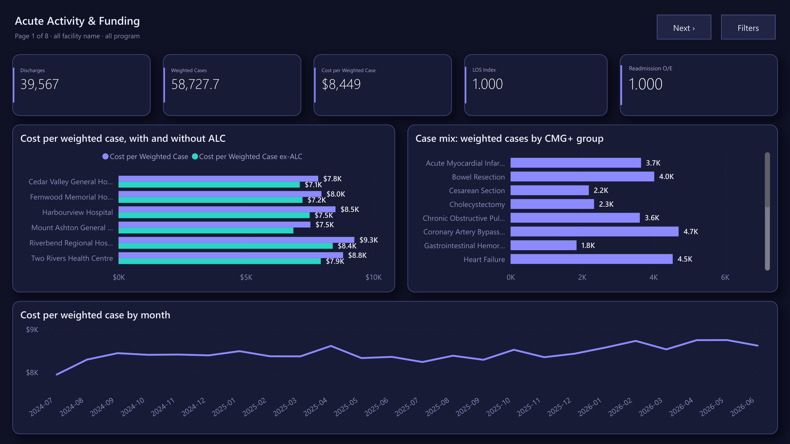
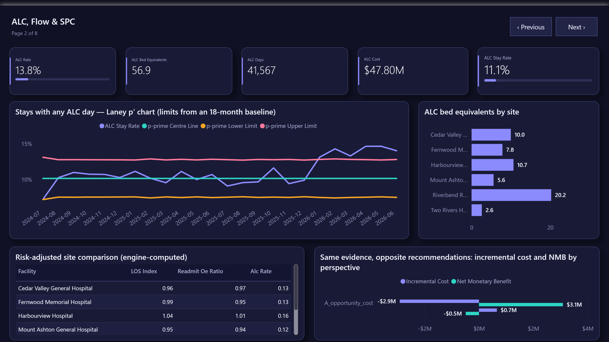
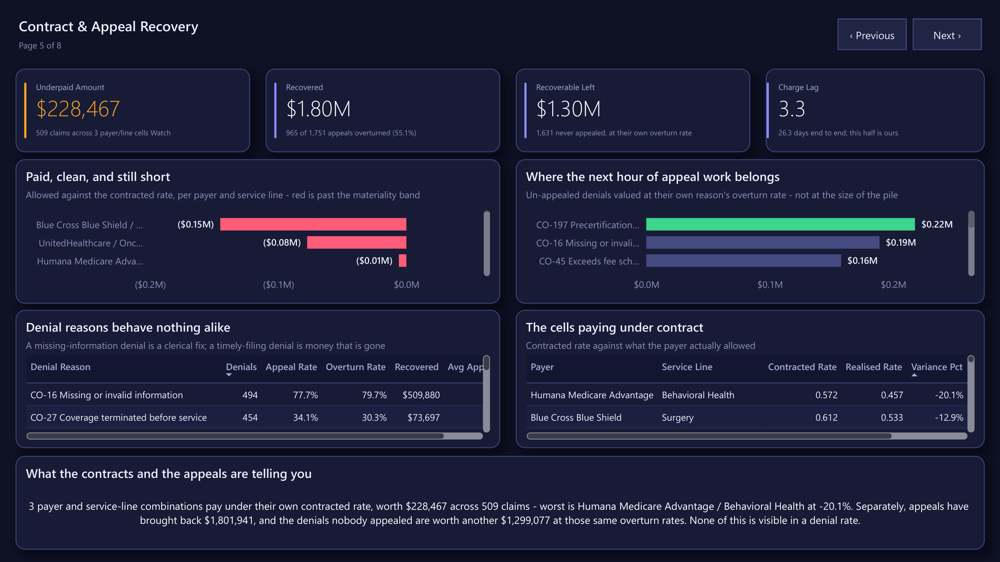
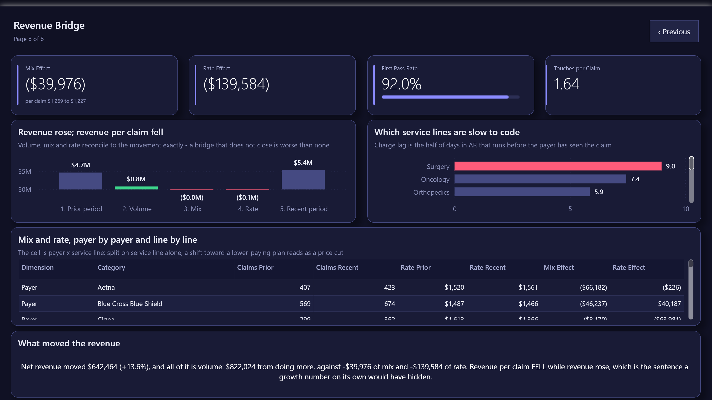
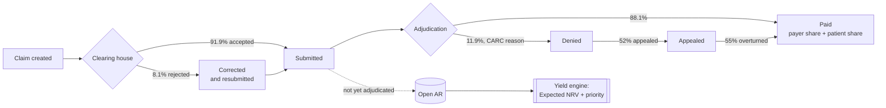

# Health System Decision Support — activity, economics, and revenue cycle

[](https://github.com/KushPatel29/healthcare-claims-analytics/actions/workflows/ci.yml)


Two health systems, one engineering standard.

**Act one — a Canadian health authority.** CIHI-DAD-shaped inpatient activity for
a six-site authority: cost per weighted case, length-of-stay index, alternate
level of care, and risk-adjusted readmission; statistical process control that
separates a real shift from ordinary variation; and a full economic evaluation
of a proposed intervention — ICER, tornado, and probabilistic sensitivity — that
ends in a briefing note and a costed business case.

**Act two — a US hospital revenue cycle.** Two years of the claim lifecycle, from
the scrubber edit before submission through adjudication to paid, denied, appealed
or pending AR — with the patient's share tracked as the separate business it is. A
Net Realizable Value model prices $5.2M of open AR at the $2.2M it will actually
collect, a denial-prevention layer names the 68.6% of denials that should never
have been submitted, and a control chart finds the month a payer changed its
authorization rules.

**All data is synthetic — no PHI.** No real patients, facilities, providers, or
payer contracts. Behaviour is modelled on publicly documented patterns.

## The engineering principle

Every number lives in a verifiable Python engine and is proven by `pytest` in CI
**before** Power BI opens the file. Power BI is a presentation layer only — no
probability modelling, yield maths, or control limits in DAX. Every figure on a
dashboard, in the briefing note, or in the business case reproduces from the
command line and is guarded by an invariant test.

Pure standard library throughout. No install step, no database; the whole thing
rebuilds in about five seconds.

---

# Act one — Canadian health authority decision support

In a single-payer system there are no payers, no denials, and no bad-debt
reserve. A BC health authority does not ask what its denial rate is. It asks
what a weighted case costs, whether patients stay longer than their case mix
predicts, how many beds are occupied by people who no longer need acute care,
and whether this month's readmission rate is a signal or noise.

**Dataset:** 39,567 discharge abstracts over 24 months, six facilities, 17 CMG+
case mix groups, with RIW, expected LOS, ALC days, comorbidity level, and
disposition. Volume is calibrated so the authority is internally coherent —
~20,000 discharges a year against 490 staffed beds is roughly 85% occupancy at
the modelled length of stay. A bed-day business case built on a dataset whose
occupancy is physically impossible does not survive its first reading.

## The four indicators

```
Discharges:                               39,567
Weighted cases (sum RIW):               58,727.7
Cost per weighted case:                    8,449
  ...excluding ALC:                        7,635
  ...ALC component:                          814
ALC rate (% of patient days):              13.8%
ALC bed equivalents (24 mo):            56.9 beds
30-day readmission rate:                    9.9%
```

**Splitting ALC out of cost per weighted case is not cosmetic.** ALC cost is not
a measure of how efficiently a site treats its cases — it is the price of a
discharge destination that does not exist. Leaving it inside CPWC makes the site
with the weakest *community* capacity look like the site with the worst cost
control. Harbourview is second-highest on the headline figure and mid-pack once
ALC is removed.

**Risk adjustment uses indirect standardisation** with empirical-Bayes shrinkage
on thin strata — the same technique the NRV engine uses on thin payer × service
line cells. The defining identity (Σ expected = Σ observed, so the
authority-wide O/E is exactly 1.00) is asserted by test; if it drifts, the ratios
are measuring the standardisation rather than the sites. A test also demands the
adjustment move the ranking *in the direction case mix predicts* — the site with
the heaviest case mix has to rank better once adjusted, the site with the
lightest has to rank worse, and at least one site has to move two places rather
than swapping on a rounding error. Merely asserting that the two rankings
differ, which is what this test used to do, is close to free: with six sites any
tie-break flip satisfies it, and a *broken* adjustment satisfies it more reliably
than a correct one, because noise reorders more readily than signal. Inverting
the O/E ratio — an easy bug to write — passes the old assertion and fails the
new one.

## Statistical process control, and the trap in it

The default way an indicator gets reported — "readmissions were 11.4%, up from
10.8%" — is a category error. Every process varies. Reacting to ordinary
variation makes the process worse; sitting on a genuine shift because it looked
small is how a problem runs for two quarters.

[`engine/spc.py`](engine/spc.py) implements p-charts, u-charts, the four Western
Electric rules, Laney's overdispersion correction, and phase I/phase II
baselines. Three findings came out of pointing it at ALC:

**1. The metric everyone asks for is the one that lies.** ALC *days* per 100
patient days is heavily overdispersed — measured dispersion **4.6×** Poisson over
the baseline, because one patient waiting sixty days contributes sixty correlated
days, not sixty independent events. Run naively it fires **41 point-signals
across 19 of 24 months**. A chart that cries wolf in four months out of five is
ignored within a quarter, which is worse than no chart.

**2. Correcting is good; changing the unit of analysis is better.** Laney's u′
brings it to **10 signals in 4 months**. But the share of *stays* with any ALC day
is one independent observation per patient, has dispersion **1.18** against 4.6
for the day-level chart, and detects the planted shift **in its first month**.
Removing clustering at the source beats correcting for it afterwards.

Signals are counted per point, as Minitab and qicharts2 count them: a month
beyond 3σ is also beyond 2σ and 1σ, so one month can trip three rules. The count
of distinct months is reported beside the raw count throughout, because that is
the number an analyst actually works.

**3. The baseline is where charts quietly go wrong.** Compute the centre line
over the whole series, including the period you are assessing, and a genuine
late shift drags the centre up — flagging every *stable* month before it as a
downward special cause. You get a chart reporting a problem in the period where
nothing happened. There is a test that plants a shift, runs the chart both ways,
and asserts the contaminated version misfires exactly this way.

Readmission was deliberately left stable, and the chart correctly says nothing —
the negative control that stops the whole exercise being confirmation bias.

## Health economics: the same evidence, opposite recommendations

[`engine/health_economics.py`](engine/health_economics.py) evaluates a $1.45M
transitional-care program against the ALC problem, and the interesting result is
that it does not have one answer.

Almost every hospital business case values an avoided bed day at the fully
absorbed per-diem and books it as a saving. That is usually wrong. Unless the bed
closes and the staffing goes, the fixed cost stays. What you created is
*capacity*, not cash. So the model reports both perspectives explicitly:

| | Perspective A — opportunity cost | Perspective B — cash-releasing |
|---|---|---|
| Bed day valued at | full $1,150 per-diem | variable share only (32%) |
| Incremental cost | **−$2,916,613** | **+$658,980** |
| Result | **Dominant** | **ICER $192,163/QALY** |
| P(cost-effective @ $50k/QALY) | **99.7%** | **16.9%** |

Both are correct; they answer different questions. Perspective A asks what the
program is worth to the health system, B asks what it does to next year's
operating budget. A business case presenting only A is why finance departments
distrust business cases.

The tornado shows **two parameters flip the recommendation on their own** — the
cash-releasing share and the effectiveness rate — and neither is the program
price. Negotiating the cost down does not rescue a weak case, so that is not
where the effort should go.

10,000-iteration PSA (Beta for proportions, Gamma for costs) produces the
acceptability curves. They never converge, because the uncertainty that matters
here is *structural* — which perspective applies — and no amount of extra Monte
Carlo sampling resolves a structural question.

**Deliverables, in the form a health authority actually consumes:**

- **[`docs/BRIEFING_NOTE.md`](docs/BRIEFING_NOTE.md)** — Issue / Background /
  Analysis / Options / Risks / Recommendation, for a VP.
- **[`docs/BUSINESS_CASE.md`](docs/BUSINESS_CASE.md)** — full costing, both
  perspectives, sensitivity, risk register, measurement plan, exit criteria.

The recommendation is to approve — **conditional on a documented backfill
commitment**, and explicitly *not* as a savings initiative. On the evidence this
program is very probably the right thing to do and very probably not a saving.
Saying both is what makes the first half believable.

## The decision-support dashboard

The first two pages of the Power BI report are the Canadian layer, and they lead
deliberately: a health-authority reader should not have to page past four screens
of US revenue cycle to reach the work that speaks to them.

### How the report is built

- **34 KPI tiles are SVG drawn by DAX measures** (`dataCategory: ImageUrl`),
  each from the measure its card already showed, the card's reference line and,
  where one exists, its status colour. Rates carry a progress rail.
- **Every page opens with a header** stating the page, its place in the report
  and the filters in effect, with Previous and Next page buttons.
- **Slicers:** every slicer sits in a filter panel that two bookmarks open and
  close without resetting a filter, while the header and the Filters button
  (`Filters · 2`) keep the filter state on screen.
- **Tables read as tables:** columns get plain headers (`Facility`, not
  `facility_name`) and widths that fill the visual, and each narrative card has
  room for its whole sentence.
- **Dark filter chrome:** the theme now styles the filter pane, filter cards and
  dropdown lists, which had opened white.

Microsoft's `powerbi-report-author validate` passes with no errors or warnings,
and every page was rendered in Power BI Desktop for the screenshots below.
[`tests/test_report_interactions.py`](tests/test_report_interactions.py)
pins the ways these patterns fail silently: an unescaped `%` turns every SVG
fill black, a bookmark that also captures data resets the filters, and a button
pointing at a deleted bookmark does nothing.

**Acute Activity & Funding** — discharges, weighted cases, CPWC, LOS index and
risk-adjusted readmission across the six sites, with case mix and the monthly
CPWC trend:



Both LOS index and readmission O/E read exactly **1.000** at the authority level,
which is not a coincidence and not a placeholder — it is the Σ expected =
Σ observed identity of indirect standardisation, asserted by test in the engine
and reproduced here by the presentation layer. A site's ratio is only meaningful
read against that 1.000.

The cost chart plots CPWC and CPWC ex-ALC on one axis deliberately: the gap
between the two bars *is* the ALC component, so the reader sees the size of the
adjustment rather than being asked to trust it. Riverbend has the highest cost
per weighted case on both measures. Harbourview is second on the headline figure
and mid-pack once ALC comes out — the difference between a site that spends too
much and a site whose community has nowhere to discharge to.

**ALC, Flow & SPC** — the ALC bed-equivalent picture by site, the Laney p′
control chart with its centre line and limits, the risk-adjusted site table, and
the two costing perspectives side by side:



The control chart is the page's argument. The observed rate sits inside its
limits for the whole 18-month baseline, then breaks the upper limit from
2026-01 and stays out — a shift the chart identifies in its first month, not
after a quarter of arguing about whether the number moved. The limits themselves
are computed once, from the baseline, and extended forward; they do not widen to
accommodate the shift they exist to catch.

The observed series is recomputed from the fact table and the three limit series
are read from the engine, which is the split the whole model is built around.
They agree month for month — 2024-07 reads 0.0723 either way.

Two things in the model are worth stating because they are the kind of decision
that usually goes unrecorded:

**There are two date tables, and that is deliberate.** `dim_month` keys the claims
and `dim_activity_month` keys the inpatient abstracts. They now cover the same 24
months, so the original reason — the claims period was shorter — no longer applies;
the current reason is that they key two separate stars. One date table filtering
both would need every activity measure wrapped in `USERELATIONSHIP`, and the first
one anybody forgot would silently return the wrong answer with nothing on the
canvas to say so. Two dimensions, each owning its own fact, is the cheaper mistake
to not make.

**Risk-adjusted figures are read, not recomputed.** `LOS Index` and
`Readmission O/E` come from the engine's `activity_by_facility` output, and the
p′ chart's limits come from `spc_alc_stay`. Both are indirectly standardised with
empirical-Bayes shrinkage, and the limits are set from an 18-month phase I
baseline and extended forward — neither is something a DAX measure evaluating in
filter context reproduces correctly. A second, subtly different answer with no
test behind it is worse than no answer.

The DAX reproduces the engine exactly: authority-wide `Readmission O/E` and
`LOS Index` both evaluate to **1.000**, which is the Σ expected = Σ observed
identity surviving all the way into the presentation layer.

---

# Act two — US hospital revenue cycle

**Dataset:** 30,000 claims over 24 months to 1 July 2026, 11 payers from Medicare
to workers' compensation, 10 service lines, 30 procedure codes, 40 providers across
5 sites. Every claim carries what the payer allowed *and* what the patient owed,
whether an authorization was required and obtained, whether the clearing house
accepted it first time, and the root cause of any denial.

Ten-page Power BI report in total, hand-authored as a Power BI Project (TMDL
semantic model + PBIR report definition) in [`powerbi/pbip/`](powerbi/pbip/) — open
`RevenueCycleAnalytics.pbip` in Power BI Desktop and hit Refresh. The eight
revenue-cycle pages:

**Revenue Cycle Scorecard** — denial rate vs target, cash collected trend, denial
rate by payer:


**Denial Analytics** — root-cause triage: denial dollars by CARC reason,
concentration by service line, trend by payer type:


**Contract & Appeal Recovery** — allowed against the fee schedule per payer
and service line, and where the next hour of appeal work belongs:



**AR Aging** — aging buckets by payer type, claim pipeline, and the
priority-sorted Intelligent Worklist:


**Predictive Yield (NRV)** — gross AR vs Net Realizable Value by payer type, and
the expected-yield worklist:


**Revenue Bridge** — price, volume and mix between two mature periods, plus the
charge-lag view of what the hospital owns in its own cycle time:



## The cheapest denial is the one you never submit

A denial rate says how often the payer said no. It does not say who could have
stopped it. **11.9%** of adjudicated claims are denied here, and **68.6% of those
denials — 2,321 claims worth $4.84M at contract — were preventable**: an
authorization nobody obtained, coverage nobody checked, a field nobody filled in.
The rest are the payer applying its own edits or disagreeing with a clinician,
which is a different argument with a different owner.

| Root cause | Owner | Denials | Share | Preventable | At contract |
|---|---|---:|---:|---|---:|
| Authorization | Front end | 442 | 13% | yes | **$1,549,969** |
| Registration & data entry | Front end | 685 | 20% | yes | $1,221,045 |
| Coding & documentation | Mid cycle | 508 | 15% | yes | $941,593 |
| Eligibility & registration | Front end | 454 | 13% | yes | $755,160 |
| Timely filing | Back end | 232 | 7% | yes | $376,482 |
| Bundling & payer edits | Back end | 596 | 18% | no | — |
| Medical necessity | Mid cycle | 284 | 8% | no | — |
| Patient responsibility | Patient | 181 | 5% | no | — |

Registration is the biggest pile of denials; **authorization is the biggest pile of
money**, because the claims it stops are the expensive ones. Ranked by count, the
front desk gets sent at the wrong queue.

### A payer changed its rules on a date, and the chart says which one

Denial rates drift for a hundred reasons. They also *step*, when a payer changes a
policy — and a month-over-month table reports a step as three consecutive bad
months and argues about each one. Charting the authorization denial rate for
**UnitedHealthcare / Cardiology** on a Laney p′ chart, with limits set from the six
months before anything changed, puts a date on it:

| | |
|---|---|
| Baseline rate | **2.7%** |
| First month outside the limits | **2025-10** |
| Months it stayed out | **6 consecutive** |
| Peak | **55.6%** in 2025-11 |

That is the same control-chart code the Canadian activity layer uses on ALC —
[`engine/spc.py`](engine/spc.py), Western Electric rules and all — because the
mathematics does not care whether the proportion is a readmission or a denial. The
cell is small (6 to 25 claims a month), so the limits are wide; the shift clears
them anyway.

### The funnel, with every stage a subset of the one above it

| Stage | Claims | Share | Contract value |
|---|---:|---:|---:|
| 1. Claims created | 30,000 | 100.0% | $56,689,393 |
| 2. Accepted by the clearing house first time | 27,560 | 91.9% | $51,926,852 |
| 3. Adjudicated by the payer | 26,031 | 86.8% | $49,150,615 |
| 4. Paid on first pass | 22,922 | 76.4% | $42,892,251 |
| + Recovered on appeal | 893 | 3.0% | $1,768,469 |

The nesting is the point, and it is not automatic. A claim the clearing house
rejects is corrected and resubmitted, so it still reaches adjudication — count
"accepted first time" and "adjudicated" from the whole book and the funnel reports
more claims adjudicated than accepted, which is how a funnel ends up describing
something that cannot happen. Recovery is shown as a recovery rather than folded
into the ladder, because it moves the other way.

The **clean claim rate** is 91.9% overall — but 90.6% in the first year against
93.0% in the second, which is a scrubber rule that was fixed, not noise.

### The patient is the payer nobody scorecards

| | |
|---|---:|
| Patient responsibility | **$10,881,240** — 23.3% of allowed dollars |
| Collected | **$4,874,088** (44.8%) |
| Written off as bad debt | $4,913,963 |
| Charity care | $994,244 |

A net collection rate of 85.6% is the average of a payer book that pays 98.5% of
what it owes and a patient book that pays 45% of what it owes. Reporting the two
together is how a hospital concludes its payers are slow when its own
point-of-service collection is the problem. Deductibles reset in January, so the
patient share of the book is seasonal — which is visible in the monthly series and
invisible in any annual average.

## What a denial rate cannot tell you

Denial rate, days in AR and net collection rate describe the claim as the payer
left it. Three questions sit outside all of them, and each needs data the claim
alone does not carry.

### A claim can be paid, clean, and still short

The payer pays what it pays. The **contract** says what it owes, and the two are
not the same document. Measuring one against the other needs a fee schedule, so
[`dim_payer_contract`](data/dim_payer_contract.csv) is a dimension — 110 payer x
service-line rates — rather than something the report re-derives from the
payments. That distinction is the whole discipline: **a variance report that
learns the contract from what was paid will always conclude the payer paid
correctly**, and it will do it convincingly. A test asserts the expected allowed
amount reconciles to the published schedule and not to the remittance.

| | |
|---|---|
| Cells paying under contract | **3 of 110** |
| Underpaid claims | **509** |
| Recoverable | **$228,467** |
| Worst by rate | **Humana Medicare Advantage / Behavioral Health, −20.1%** |
| Worst by dollars | **Blue Cross Blue Shield / Surgery, $145,199** |

Those are two different cells, and the report names them separately. "Worst" is
ambiguous the moment a small contract is badly wrong and a large one is slightly
wrong; a single label quietly means whichever the code happened to sort by. Here
the deepest discount is on a behavioural-health book worth $5,872 in total, and
the biggest loss is a surgery contract that is only 12.9% short.

A materiality band does the other half of the work. Adjudication moves every
allowed amount a few percent either way, so a report that flags every dollar
below contract flags roughly half the paid book and gets ignored by week two.
Only a shortfall past 5% counts, at the claim **and** at the cell — and the test
checks that more claims fall inside the band than are flagged, so the band is
demonstrably suppressing noise rather than decorating the method.

### "We appealed it" is not "we got the money"

`resubmitted` says a denial was worked. It does not say whether anything came
back, and by reason the answer differs enormously:

| Denial reason | Denied | Appealed | Overturned | Recovered |
|---|---:|---:|---:|---:|
| CO-16 Missing or invalid information | 494 | 78% | **80%** | $510k |
| CO-197 Precertification/authorization absent | 442 | 62% | 37% | $313k |
| CO-27 Coverage terminated before service | 454 | 34% | 30% | $74k |
| CO-11 Diagnosis inconsistent with procedure | 306 | 60% | 66% | $186k |
| CO-97 Service bundled/included | 335 | 40% | 35% | $79k |
| CO-29 Timely filing limit expired | 232 | 27% | **10%** | $9k |

A missing-information denial is a clerical fix that mostly comes back. A
timely-filing denial is money that is gone, and every hour spent appealing one
is an hour not spent on the first. So the page does not rank denial reasons by
size — it ranks them by **recoverable dollars left**: the denials nobody
appealed, valued at that reason's own overturn rate. **$1,299,077** is sitting in
that column, and the ranking it produces is not the ranking by volume — the
biggest pile of recoverable money is behind **CO-197**, the authorization denials,
not behind the most common code. An expected value, clearly labelled as one; it is
the only honest way to sequence a backlog.

Appeals have already brought back **$1,801,941** on 965 overturns.

### Revenue went up. That is not a finding.

Net revenue rose **$2,944,393 (+17.2%)** between two 333-day windows. Whether that
happened because the hospital did more cases, because each case pays more, or
because the case mix moved are three different conversations with three different
owners, and the growth number alone cannot tell them apart:

| | |
|---|---:|
| Prior window | $17,148,088 · 10,655 claims at **$1,609** |
| Volume | **+$2,980,597** |
| Mix | +$32,350 |
| Rate | −$68,554 |
| Recent window | $20,092,482 · 12,507 claims at **$1,606** |

All of the growth is volume, and **revenue per claim fell while revenue rose** — a
Medicare fee-schedule cut that lands on the boundary between the windows, worth
−$142,429 of rate on Medicare alone, against a book drifting toward Medicare
Advantage that is worth +$819,949 of mix. The two nearly cancel at the top line,
which is exactly why a headline of "+17.2%" is not a finding: net mix of +$32,350
is the residue of two seven-figure movements in opposite directions.

Two decisions make that decomposition mean anything:

**The cell is payer x service line, not service line.** Split on service line
alone, a shift from a commercial plan to a Medicare Advantage plan — same
procedures, lower contracted share of billed — has nowhere to land but the rate
term, and the report says prices fell when what moved was the mix. The test
computes the decomposition **both ways** and asserts the coarse grain pushes
materially more of the movement into rate; the modelling choice is demonstrated
rather than asserted.

**Both windows end 75 days back.** Claims submitted recently are still
adjudicating, so the last weeks of any window are systematically short of paid
dollars. A bridge that runs to the snapshot date reports a volume collapse that
is really the adjudication lag — and it does it every single period. The windows
are also derived from the data rather than hard-coded, because a fixed six
months either side silently runs off the front of the dataset and reports the
shortfall the same way.

Volume + mix + rate reconciles to the movement to the cent, and that is asserted
in the engine as well as in the tests: a bridge whose bars do not add up is
worse than no bridge, because it looks like one.

### Underneath days in AR

Days in AR is **89.9** (open AR over 90 days of net revenue). Part of the cycle
happens before the payer has seen the claim at all: charge lag averages **3.4 days**
overall but **9.0 for Surgery** against **1.0 for Laboratory**, and that half of the
number is the hospital's to fix without anyone's cooperation. First-pass resolution
is **88.1%**, and the book carries **74,603 follow-up touches** — 2.49 a claim,
which is the revenue cycle's real capacity constraint.

**What this deliberately does not compute.** Cost to collect in dollars. Touch
counts are an operational fact; a cost per touch is an assumption, and
multiplying the two would turn a measurement into an opinion with a currency
symbol in front of it.


## Why NRV changes the conversation

Anyone can sum days in AR. The senior insight is that **not every AR dollar is
worth a dollar.** $100k of Medicare AR is close to cash — Medicare pays ~91% of
allowed, reliably. $100k of Self-Pay AR is worth a fraction, because self-pay
collects ~20 cents on the dollar and the rest ages into bad debt.

The model nets **$5.24M of gross open AR down to $2.24M of Expected NRV** — a 43%
realization rate, i.e. a ~57% bad-debt reserve. That delta is exactly the number a
CFO books as a reserve, computed from first principles rather than guessed.

| Payer type | Net collection rate | Expected yield (per billed $) |
|---|---:|---:|
| Workers' Comp | 97% | 70% |
| Military (TRICARE) | 97% | 52% |
| Commercial | 89% | 52% |
| Medicare | 91% | 43% |
| Medicare Advantage | 91% | 43% |
| Medicaid and Medicaid MC | 96% | 38% |
| **Self-Pay** | **20%** | **19%** |

Net collection rate here is cash against the whole allowed amount, so it carries
the patient's share as well as the payer's. That is why commercial sits at 89%
while the payer itself pays 98.5% of what it owes: the missing 11 points are
deductibles and coinsurance, and they collect at 45%, not at 98%.

```
expected_yield_rate = contractual_factor      # allowed / billed   (paid claims)
                    × net_collection_rate      # paid / allowed     (paid claims)
                    × (1 − denial_propensity)  # P(adjudicates as paid)

Expected_NRV   = billed_amount × expected_yield_rate
Priority_Score = Expected_NRV × (days_in_AR / 30)
```

**Empirical-Bayes shrinkage.** Payer × service-line cells are thin — a payer with
a handful of Oncology claims would otherwise get a wild rate. Every cell shrinks
toward its own payer's rate, and each payer toward the portfolio rate. A thin
Self-Pay/Oncology cell borrows strength from *all* Self-Pay claims, which really
do collect ~20¢, not from a global average Medicare dominates.

### Deliberate deviations from the brief

- **NRV is decomposed from billed, not allowed.** A *pending* claim has no
  allowed amount — multiplying a blank field would produce zero NRV for the whole
  open AR. The engine estimates expected allowed (`billed × contractual_factor`)
  and carries it through, so the ceiling test becomes `NRV ≤ billed` — a bound
  that exists in the data.
- **Priority does not multiply by `(1 − denial)` twice.** `Expected_NRV` already
  nets out denial probability, so the naive formula double-counts it.

### KPI definitions

| KPI | Definition in this model |
|---|---|
| Denial rate | Denied ÷ adjudicated claims (Paid + Denied) |
| **Preventable denial share** | Denials whose root cause is a front-end or coding failure ÷ denials |
| **Clean claim rate** | Accepted by the clearing house on first submission ÷ claims created |
| First-pass resolution | Paid without an appeal ÷ adjudicated |
| Net collection rate | Cash ÷ allowed $ — payer share and patient share together |
| **Patient collection rate** | Patient cash ÷ patient responsibility |
| Avg days to adjudicate | Submission → adjudication lag |
| AR > 90 | Open (pending) claim dollars older than 90 days |
| **Expected NRV** | Forecast cash on open AR: Σ billed × expected yield rate |
| **Bad-debt reserve** | Gross open AR − Expected NRV |
| **Priority score** | Expected NRV × (days in AR ÷ 30) — the worklist rank |

Clean claim rate and first-pass resolution are routinely reported as one number,
and they measure different failures: the first is the hospital's own data quality
before anything is submitted, the second is what the payer did with a claim that
was accepted. A claim can be rejected by the scrubber, corrected, and then paid on
first pass, and only one of the two rates notices.


```mermaid
flowchart LR
    CREATE[Claim created] --> SCRUB{Clearing house}
    SCRUB -->|"91.9% accepted"| SUB[Submitted]
    SCRUB -->|"8.1% rejected"| FIX[Corrected<br/>and resubmitted] --> SUB
    SUB --> ADJ{Adjudication}
    ADJ -->|"88.1%"| PAID[Paid<br/>payer share + patient share]
    ADJ -->|"11.9%, CARC reason"| DEN[Denied]
    DEN -->|"52% appealed"| RESUB[Appealed] -->|"55% overturned"| PAID
    SUB -.->|not yet adjudicated| AR[(Open AR)]
    AR --> NRV[[Yield engine:<br/>Expected NRV + priority]]
```

---

# Governance: privacy and data quality

## De-identification with a measured risk

Every dataset here is synthetic, so nothing in
[`governance/deidentify.py`](governance/deidentify.py) protects a real person.
That is exactly why it is worth building — the technique has to exist and be
tested *before* it is pointed at real data, and "we de-identified it" is the most
over-claimed sentence in health analytics.

Two things happen, and they are not the same:

1. **HIPAA Safe Harbor** — the 18 direct-identifier categories, matched by
   *pattern* rather than a hard-coded list, so a newly added identifier column
   fails the test on arrival.
2. **k-anonymity (k=5)** — the hard half. Nobody is re-identified by their name
   in a de-identified file; they are re-identified by the *combination* that
   survives it. Generalise first, suppress only as a fallback.

```
Records in:                           39,567
Unique on quasi-identifiers:             449 (1.14%)
Records generalised:                   3,390
Records suppressed:                    1,405 (3.55%)
Smallest equivalence class:                5
Max re-identification probability:     0.200
```

The suppression *cost* is reported, because a de-identification that hides its
cost cannot be argued with. A test also proves the surviving dataset still
reproduces the authority's ALC share — privacy work that leaves the data unable
to answer its question has only relocated the failure. Another test confirms the
audit trail records keys only, never a suppressed value.

## The data quality gate

[`governance/data_quality.py`](governance/data_quality.py) — 15 declarative rules
across completeness, uniqueness, referential integrity, domain, business logic,
and a freshness SLA. Critical failures exit non-zero and block the refresh;
warnings are recorded and let the run proceed, because halting month-end over
three unexpected disposition codes trades a data problem for an availability
problem.

Rules are data, not code, each carrying a **rationale** — a rule nobody can
explain gets deleted the first time it fires inconveniently. Expression rules use
a tiny named-form language rather than `eval()`, and a test proves an unknown
expression is *refused*: configuration that can execute arbitrary Python is a
supply-chain vulnerability wearing a YAML hat.

```bash
python governance/data_quality.py                   # PUBLISH, exit 0
python governance/data_quality.py --inject-failure  # BLOCKED, exit 2
```

CI runs both, and **fails the build if the corrupted run is allowed through.**
A gate you have never watched close is decoration.

Every run appends JSONL events — `run_id`, rule, status, violations, rows
scanned, duration, verdict — to an ops log Datadog or Azure Monitor can tail
as-is. One `run_id` reconstructs any run end to end, including the failed ones,
which are the runs telemetry exists for.

**[`docs/SOURCE_TO_TARGET.md`](docs/SOURCE_TO_TARGET.md)** carries the full
column-level mapping, transformation rules, ownership, and a consolidated list of
known limitations — in the mapping itself rather than in a separate risk log,
because the place a limitation gets read is next to the column it applies to.

## The board decision is governed too

The business case answers whether the intervention is worth doing. It did not,
by itself, answer whether the evidence was ready to release for an implementation
decision. [`governance/decision_assurance.py`](governance/decision_assurance.py)
now assembles that separate control plane:

| Release decision | Gates passing | Review required | Blocking |
|---|---:|---:|---:|
| **REVIEW REQUIRED** | **8** | **2** | **0** |

The two reviews are intentional, not defects hidden behind a green badge. ED
boarding hours and surgical postponements still need production baselines, and
the executive sponsor plus Finance/Operations still need to record the decision
and the backfill commitment. Analytics cannot approve its own recommendation.

The release includes:

- **[board decision packet](output/health_intervention_decision_packet.md)** —
  recommendation, four options, evidence gates, conditions, and audit boundary;
- **[versioned measure register](output/health_measure_register.csv)** — grain,
  numerator, denominator, exclusions, owner, and baseline status for six measures;
- **[equity monitoring extract](output/equity_monitoring.csv)** — facility ×
  age-band outcomes with a documented small-cell threshold;
- **[machine-readable release gates](output/evidence_release_gates.csv)** and a
  **[SHA-256 evidence manifest](output/health_decision_manifest.json)**; and
- a **[re-verification drill](output/health_reverification_evidence.json)** that
  introduces a critical DQ failure in memory and proves the decision changes from
  REVIEW REQUIRED to BLOCKED without mutating source evidence.

This is a CIHI-inspired portfolio crosswalk, not an official CIHI specification,
submission, certification, or clinical recommendation. The production hand-off
and its limits are explicit in
[`docs/DECISION_ASSURANCE_RUNBOOK.md`](docs/DECISION_ASSURANCE_RUNBOOK.md).

---

## Reproduce everything (about five seconds)

```bash
# Canadian decision support
python canadian/generate_activity_data.py   # 40k DAD-shaped abstracts
python engine/build_activity_metrics.py     # CPWC, LOS index, ALC, SPC charts
python engine/health_economics.py           # base case, tornado, PSA/CEAC

# US revenue cycle
python data_generator/generate_claims_data.py
python engine/build_rcm_metrics.py           # denials, AR aging, NRV worklist
python engine/build_revenue_integrity.py     # contract variance, appeals, bridge
python engine/build_denial_prevention.py     # root cause, funnel, SPC, patient collections

# Governance
python governance/deidentify.py
python governance/data_quality.py
python governance/decision_assurance.py       # measure register, release gates, manifest

pytest tests/ -v                            # 807 invariants
```

Then open `powerbi/pbip/RevenueCycleAnalytics.pbip` (see
[`powerbi/pbip/OPEN_ME_FIRST.md`](powerbi/pbip/OPEN_ME_FIRST.md)) and Refresh.

## What CI enforces

**Activity and funding** — LOS decomposes exactly into acute + ALC days; facility
and monthly rollups tie to the abstracts to the penny; CPWC ex-ALC differs from
the headline by precisely the ALC cost; indirect standardisation satisfies
Σ expected = Σ observed; risk adjustment reorders the sites in the direction case
mix predicts, by at least two places; the planted ALC outlier site is recovered.

**SPC** — each Western Electric rule fires on a series built to trip it and stays
silent otherwise; a missing period breaks a run rather than bridging it, checked
on the *counting* rules 2 and 3 where the guard actually decides the outcome
(rule 4 cannot distinguish, and the test that only checked rule 4 passed with the
guard deleted); a stable process produces zero signals; a planted shift is
detected, in the right direction, promptly; dispersion ≈ 1.0 on binomial data and
> 1.5 on clustered data; Laney widens limits and suppresses false alarms on
overdispersed data, and stays inside a documented band — *not* a no-op — on
well-behaved data; a contaminated baseline misfires in the documented way.

**Published figures** — every headline number in this README and in the two
decision-support documents is re-derived from the engine output and matched
against the prose, character for character. If a generator changes and a document
is not updated, the build fails and names the file. The badge's own test count is
checked the same way. This section is the claim most worth distrusting in any
portfolio repo, so it is the one under the tightest guard.

**Health economics** — incremental cost decomposes exactly; NMB and ICER match
their definitions; QALYs are identical across perspectives while costs are not;
dominance is *labelled*, never left as a bare negative ratio; a zero-effect
program reports no ICER rather than dividing by zero; more effectiveness never
lowers NMB; the CEAC is monotonic and bounded; at least one parameter flips the
decision; Beta fitting survives an impossible standard deviation.

**Governance and decision assurance** — no direct identifier survives (and the source genuinely had
some); every equivalence class meets k; a uniquely identifying combination is
removed; generalisation outweighs suppression; the de-identified data still
answers the question; pseudonyms are salted, stable, and not a bare hash; the
gate closes on a duplicated grain key; every rule carries a severity and a
rationale; an unknown expression rule is refused; every run leaves a
reconstructable trail, including the failures. The decision release also pins
measure definitions, source hashes, small-cell handling, open approvals, and
pending baselines; its in-memory failure drill must change the verdict to BLOCKED.

**Revenue cycle** — paid ≤ allowed ≤ submitted; every denial carries a CARC
reason and zero payment; AR aging ties to pending claims to the penny; NRV never
exceeds billed or expected allowed; yield = contract × NCR × (1 − denial) row by
row; the worklist is densely ranked and every open claim scored exactly once; a
Self-Pay dollar is worth materially less than an insured one.

**Power BI integrity, without opening Power BI** — every column, measure, and
sort field a visual references exists in the TMDL model (a mistyped field renders
a blank visual, not an error); no chart plots a column the model cannot
aggregate, which renders empty rather than raising; relationships and sort-by
columns point at real columns; the yield table's columns match the engine's CSV
headers exactly; every
discharge month in the abstracts exists in the calendar it is joined to, because
a date dimension that does not span its fact table drops the unmatched rows into
a blank member and under-reports in silence; and the risk-adjusted measures still
read the engine output rather than recomputing the standardisation in DAX.

## Repo layout

```
canadian/           generate_activity_data.py — DAD-shaped abstracts (CMG+, RIW, ALC)
data_generator/     synthetic claims generator (30k claims, 11 payers)
data/               generated CSVs for both datasets
engine/             build_activity_metrics.py — CPWC, LOS index, ALC, risk adjustment
                    spc.py — p/u charts, Western Electric, Laney, baselines
                    health_economics.py — ICER, NMB, tornado, PSA/CEAC
                    build_rcm_metrics.py — denial summary, AR aging, NRV worklist
                    build_revenue_integrity.py — contract variance, appeal
                    yield, price/volume/mix bridge, charge lag
                    build_denial_prevention.py — root cause, claim funnel,
                    patient collections, payer scorecard, authorization SPC
governance/         deidentify.py — Safe Harbor + k-anonymity + risk report
                    data_quality.py — 15-rule gate, JSONL observability
                    decision_assurance.py — versioned board release control
docs/               BRIEFING_NOTE.md · BUSINESS_CASE.md · SOURCE_TO_TARGET.md ·
                    DECISION_ASSURANCE_RUNBOOK.md
output/             every engine result — reproducible outside Power BI
powerbi/            ready-to-open PBIP (TMDL model + PBIR report, 22 DAX measures)
tests/              807 invariants across activity, SPC, economics, governance,
                    revenue cycle, and Power BI model/report integrity
.github/workflows/  CI — full rebuild, invariants, and the DQ sabotage proof
```

## Notes on the synthetic data

Both datasets use fixed seeds. Payer mix, denial reason distribution (CO-16
leading, as in practice), adjudication lags, collection rates, case mix, RIW,
ALC concentration, and readmission drivers are calibrated to publicly documented
patterns — not to any real organisation's data. Facility names are invented.

Seven things are planted on purpose and labelled as such. On the Canadian side, a
**step increase in ALC risk from January 2026**, so the control charts have a real
shift to find, and **site-level differences** in cost, length of stay, ALC and
acuity, so the site comparison and the risk adjustment have something genuine to
recover. On the revenue-cycle side: **three payer x service-line contracts that pay
under their own schedule** (one large and slightly short, one small and badly
short), a **Medicare fee-schedule cut** that lands on the boundary of the two
bridge windows, a **payer mix drifting toward Medicare Advantage**, a **payer that
starts requiring authorization for cardiology** in October 2025, and a **claim
scrubber rule** that lifts the clean claim rate between the two years. A detector
that cannot find a planted signal will not find a real one.
