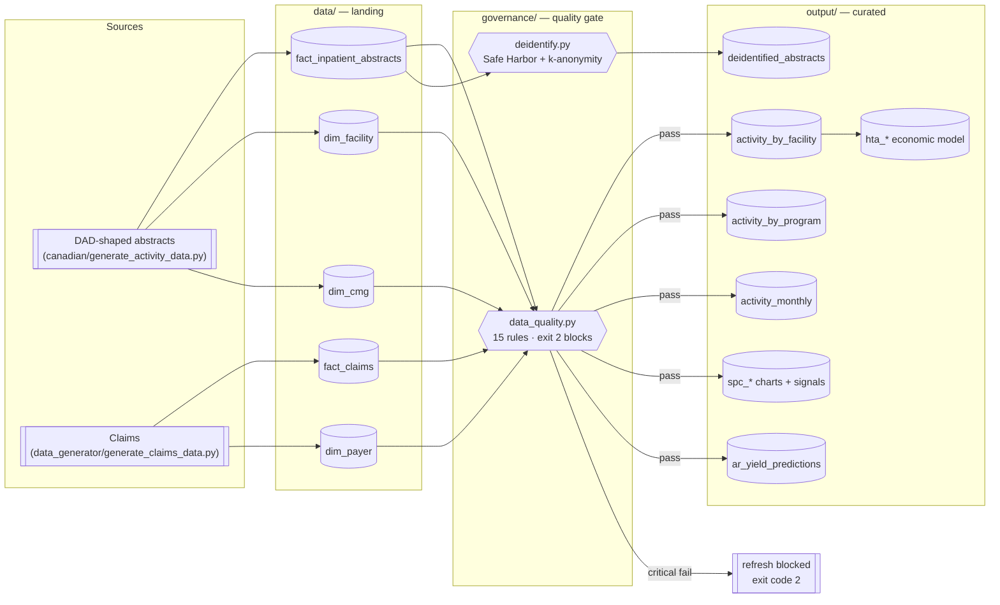

# Source-to-target mapping and data lineage

The document a data-governance team asks for and almost never receives: what
lands where, what happens to it in between, who owns the definition, and what is
known to be wrong with it.

Two rules govern this file:

1. **It is generated-adjacent, not aspirational.** Every column listed below
   exists in the artefacts the pipeline actually writes, and the test suite
   asserts that the Power BI semantic model references only fields that exist.
   A mapping document that drifts from the pipeline is worse than none, because
   people trust it.
2. **Known limitations are in the mapping, not in a separate risk log.** The
   place a limitation gets read is next to the column it applies to.

---

## 1. Lineage overview

**Load pattern:** full rebuild from a fixed seed on every run. Deliberate — the
whole repository is reproducible from nothing, so there is no incremental
watermark to reason about here. The incremental and CDC patterns live where they
can be demonstrated against a real warehouse (`supply-chain-analytics-dbt`,
`supply-chain-control-tower`).

---

## 2. Source-to-target — acute care activity

### 2.1 `fact_inpatient_abstracts` → `output/activity_by_facility.csv`

**Grain:** one row per facility. **Refresh:** full rebuild.
**Owner:** Decision Support. **Consumers:** Power BI activity pages, `health_economics.py`, `docs/BRIEFING_NOTE.md`.

| Target column | Source column(s) | Transformation | Notes / limitations |
|---|---|---|---|
| `facility_name` | `dim_facility.facility_name` | Lookup on `facility_id` | Referential integrity enforced by **DQ-003**; an orphan key blocks the refresh |
| `discharges` | `fact_inpatient_abstracts` | `COUNT(*)` | Grain uniqueness enforced by **DQ-002** |
| `weighted_cases` | `riw` | `SUM(riw)` | RIW is grouper-assigned from the case, never from actual spend — that is what makes it a fair denominator |
| `total_cost` | `total_cost` | `SUM` | Includes the ALC per-diem component |
| `cost_per_weighted_case` | derived | `total_cost / weighted_cases` | **Limitation:** not comparable across sites without the ex-ALC split below |
| `cost_per_weighted_case_ex_alc` | derived | `(total_cost − alc_days × $1,150) / weighted_cases` | The comparable figure. ALC cost measures community capacity, not the site's cost control |
| `acute_days` | `acute_los_days` | `SUM` | |
| `expected_acute_days` | `cmg_code`, `comorbidity_level` | Indirect standardisation against authority-wide stratum means, empirical-Bayes shrunk (k=25), then rescaled so Σexpected = Σobserved | **Limitation:** standardised on case mix and comorbidity only. No adjustment for socio-economic status or frailty, both of which plausibly drive LOS |
| `los_index` | derived | `acute_days / expected_acute_days` | Authority-wide index is exactly 1.00 by construction; sites are read relative to each other, never against an external benchmark |
| `alc_days` | `alc_days` | `SUM` | |
| `alc_stays` | `alc_days` | `COUNT(alc_days > 0)` | The preferred SPC denominator — one observation per patient |
| `alc_rate` | derived | `alc_days / patient_days` | |
| `alc_bed_equivalents` | derived | `alc_days / 730` | 730 = days in the 24-month window. Change the window and this constant must change with it |
| `alc_cost` | derived | `alc_days × $1,150` | Per-diem is a modelling assumption, not a costed figure — see `docs/BUSINESS_CASE.md` §5 |
| `observed_readmits` | `readmit_30d` | `SUM` | |
| `expected_readmits` | `program`, `age_band`, `comorbidity_level` | Indirect standardisation as above | **Limitation:** no adjustment for prior utilisation or discharge destination, the two strongest known predictors after comorbidity |
| `readmit_oe_ratio` | derived | `observed / expected` | Crude and adjusted rank the sites differently — report the adjusted figure only |

### 2.2 `activity_monthly` → SPC charts

**Grain:** one row per discharge month per chart. **Owner:** Decision Support.

| Target | Source | Transformation | Notes |
|---|---|---|---|
| `spc_readmission_pchart.csv` | `observed_readmits`, `discharges` | p′-chart, pooled centre, per-point binomial sigma, Laney corrected, **baseline = first 18 months** | Baseline set by standing rule (period preceding the monitoring window), not chosen post hoc |
| `spc_alc_uchart.csv` | `alc_days`, `patient_days/100` | u′-chart, Poisson sigma, Laney corrected | **Limitation:** measured dispersion 4.8x. Usable only with the correction; the uncorrected chart produces ~41 false signals |
| `spc_alc_stay_pchart.csv` | `alc_stays`, `discharges` | p′-chart | The chart that should be published — independent observations, dispersion ≈ 1.1 |
| `spc_signals.csv` | all three charts | Western Electric rules 1–4 | A missing period breaks a run rather than bridging it |

---

## 3. Source-to-target — revenue cycle

### 3.1 `fact_claims` → `output/ar_yield_predictions.csv`

**Grain:** one row per open (pending) claim. **Owner:** Revenue Cycle.

| Target column | Source | Transformation | Notes |
|---|---|---|---|
| `contractual_factor` | `allowed_amount / submitted_amount` on paid claims | Empirical-Bayes shrunk over (payer × service line) → payer → portfolio | Two-level hierarchical prior; k=20 |
| `net_collection_rate` | `paid_amount / allowed_amount` on paid claims | as above | |
| `denial_propensity` | `status` on adjudicated claims | as above | Shrinkage guarantees the estimate lands strictly inside (0,1) |
| `expected_yield_rate` | derived | `contractual × NCR × (1 − denial)` | |
| `expected_nrv` | derived | `billed × expected_yield_rate` | **Limitation:** decomposed from *billed*, not allowed — a pending claim has no allowed amount. See README |
| `priority_score` | derived | `expected_nrv × (ar_age_days / 30)` | Denial is not applied twice; `expected_nrv` already nets it out |

---

## 4. Privacy transformations

`governance/deidentify.py` — applied before any patient-level extract leaves the
curated layer.

| Source field | Target field | Transformation | Basis |
|---|---|---|---|
| `mrn` | `patient_key` | Salted SHA-256, truncated to 16 hex | Pseudonymisation. **Salt must come from a secrets manager in production**; the CI fallback is a documented weakness |
| `patient_name` | *(dropped)* | Removed | Safe Harbor — names |
| `postal_code` | `postal_prefix` | First 3 characters (FSA) | Safe Harbor — geographic subdivision |
| `admit_date` | `admit_year`, `admit_month` | Truncated to year / year-month | Safe Harbor — dates. Dates of service are identifying |
| `discharge_date` | *(dropped)* | Removed | as above |
| `age_band` `85+` | `89+` | Aggregated | Safe Harbor — ages over 89 |
| *(all quasi-identifiers)* | — | k-anonymity, k=5: generalise first, suppress only if still short | **Cost is reported**: ~3.7% of records suppressed, ~8.7% generalised |

**Quasi-identifier set:** `age_band`, `postal_prefix`, `sex`, `admit_year`,
`program`, `cmg_code`. Adding a field to the published extract without adding it
to this set is the most likely way this control fails.

---

## 5. Data quality rules

Full rule set in `governance/data_quality.py`; results in `output/dq_results.csv`.

| Severity | Behaviour | Count |
|---|---|---|
| `critical` | Halts the run, exit code **2**, downstream refresh blocked | 13 |
| `warning` | Recorded, run proceeds | 2 |

Warnings are not a softer form of critical — they are for conditions where
halting a month-end refresh would cause more harm than the defect. Unexpected
discharge disposition codes (new codes appear legitimately after a source-system
upgrade) and extract freshness are both in that category.

**Observability:** every run appends JSONL events to `output/dq_events.jsonl` —
`run_id`, rule, status, violations, rows scanned, duration, verdict. One
`run_id` reconstructs any run end to end, including runs that failed.

---

## 6. Known limitations, consolidated

The list a reviewer should read before quoting any number in this repository:

1. **All data is synthetic.** Calibrated to publicly documented patterns; no
   real patient, facility, payer, or budget appears anywhere.
2. **Risk adjustment is indirect and thin.** Case mix, age, and comorbidity
   only. No socio-economic status, frailty index, prior utilisation, or
   discharge destination.
3. **The ALC per-diem and its variable share are assumptions**, and the business
   case's conclusion is highly sensitive to the second of them (it flips the
   recommendation on its own).
4. **Cost per weighted case is not externally benchmarked.** Site comparison is
   internal only; nothing here should be read against a CIHI-published figure.
5. **The full-rebuild load pattern is a portfolio choice**, not a production
   recommendation, and would not survive contact with a real DAD extract.
6. **The de-identification salt falls back to a fixed value** so CI is
   reproducible. This is safe only because the data is synthetic.
